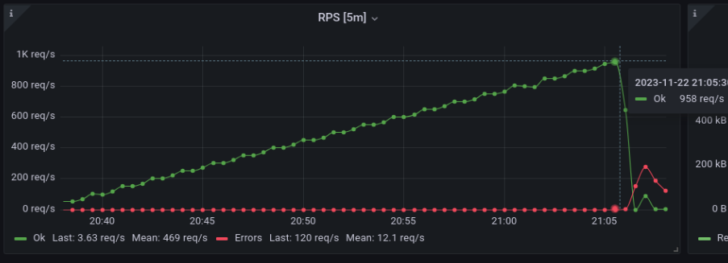

# weather-api-load-test

## Профиль нагрузки

- `GET http://91.185.85.213/cities`
- `GET http://91.185.85.213/forecast`

## Нефункциональные требования по производительности сервиса weather-api

1. Количество запросов в секунду:

   1. В обычном режиме - 400 RPS (поровну на обе ручки).
   2. В периоды пиковой нагрузки - 850 RPS.

2. Какое допустимое время ответа сервера:

    1. В обычном режиме:
        - 50% запросов: <= 10ms.
        - 90% запросов: <= 20ms.
        - 95% запросов: <= 50ms.

    2. В периоды пиковой нагрузки.
        - 50% запросов: <= 30ms.
        - 90% запросов: <= 60ms.
        - 95% запросов: <= 150ms.

## Инструмент нагрузочного тестирования

В качестве инструмента нагрузочного тестирования была выбрана утилита vegeta.
Подготовлен скрипт peak.sh для имитации нагрузки на систему в обычном режиме с кратковременным всплеском нагрузки до пикового состояния. 

Последовательность стресс-теста:
    - прогрев: 5 RPS на 5 секунд;
    - обычный режим: 400 RPS на 300 секунд; 
    - пиковый режим: 850 RPS на 60 секунд;
    - обычный режим: 400 RPS на 300 секунд;

Для определения максимальной производительности подготовлен скрипт loader.sh, который выполняет последовательный запуск нагрузки с параметрами rate [ 50 - 1000 ] с шагом в 50rps. Каждый шаг длится 120секунд.

## Максимальная производительность системы 

Определение проводилось скриптом loader.sh и утилитой vegeta.

Выполнялась последовательная нагрузка в диапазоне от 50 RPS до 1100 RPS с шагом 50 RPS. Длина итерации - 120 секунд.
Выяснил, что система остается работоспособной при 950 RPS при кратковременной нагрузке в течение 60 секунд.

## Выводы

Судя по дашборду из node-exporter, хост с postgresql упирается в RAM на хостах с БД. Видно даже что он начинает свопить.

Также, видно что система очень близка к своим предельным значениям CPU для weather-api в k8s.

Пример графика по определению максимального значения RPS:
